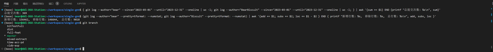
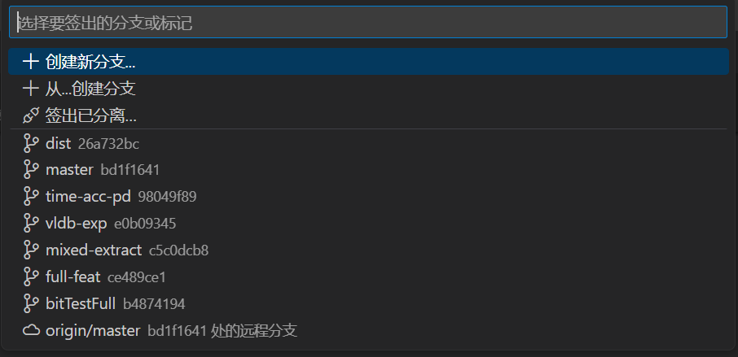
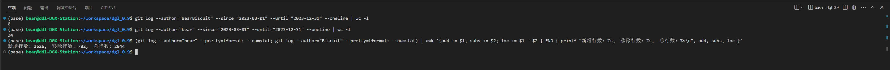
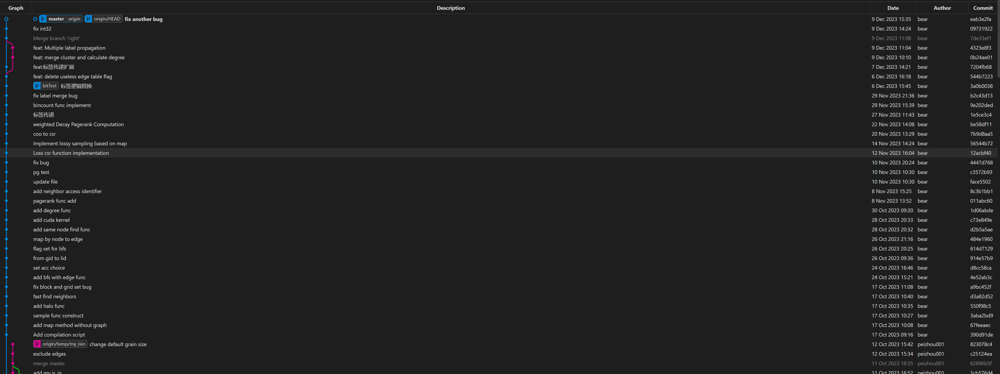

# GNN项目

PS：由于论文暂未发表，无法完整开源所有内容，但面试中确实因为基础不扎实(之前的项目一直重视实践，各种语言混合使用，忽视了基础的巩固)，导致被面试官质疑简历的真实性，因此在此仓库进行简单开源，同时也是方便面试官了解这项工作的一个大题框架。基础知识1月开始巩固，希望后面也能匹配自己的简历(2024.1.24)。

---

## 项目思路介绍

项目分为两个开发部分，
1. 在自己设计的框架内部进行数据预处理，训练与测试。主要是通过继承`torch`中的`dataset`与`dataloader`函数来实现数据调用 
2. 对于可能需要自定义C++/CUDA的api方法，则注册进入dgl0.9版本进行实现，这样可以在`python`中直接通过导入dgl库，来对自定义函数进行调用。

---

## 项目信息

gnn框架部分master分支情况(bear和BearBiscuit是在两台主机上进行工作,git config username设置不一致导致的):

分支开发情况:

目前也有分布式部分的开发，在分布式docker集群中，因此代码总计应该超过11k行，且在gitignore文件中对于配置文件等不重要文件进行了筛除，因此不会存在冗余文件填充的情况。(此处gitignore文件有具体信息)。

详细git日志:`git_log.txt`

## dgl拓展部分

拓展部分git统计：

dgl日志提交 git graph展示(因为提交次数不多，所以直接放出来)

